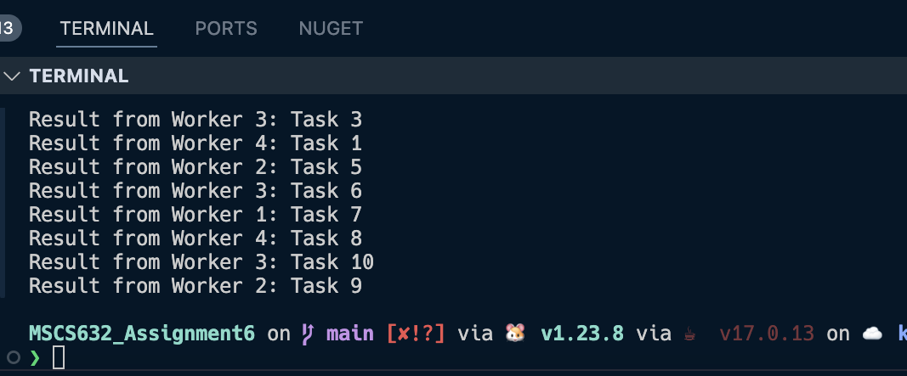

# MSCS632_Assignment6
## Setup
- **Step 1:** Download go https://go.dev/doc/install
- **Step 2:** Download java https://www.java.com/en/download/manual.jsp

## Output
When running with the following command
```
go run main.go
```
the application will show the result
